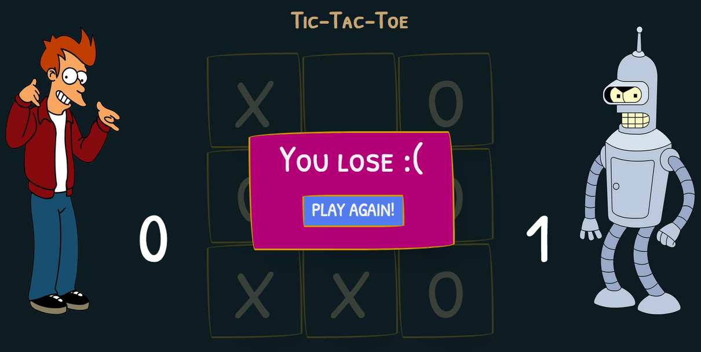

# Tic-Tac-Toe

<p align="center"></p>

Tic-Tac-Toe is a simple Nodejs web application that contains an example of a Broken Access Control vulnerability and its main goal is to describe how a malicious user could exploit it.

## Index

- [Definition](#what-is-broken-access-control)
- [Setup](#setup)

## What is Broken Access Control?

Restrictions on what authenticated users are allowed to do are often not properly enforced. Attackers can exploit these flaws to access unauthorized functionality and/or data, such as access to other users' accounts, view sensitive files, modify other users’ data, change access rights, etc.

The main goal of this app is to discuss how **Broken Access Control** vulnerabilities can be exploited and to encourage developers to send Pull Requests on how they would mitigate these flaws.

## Setup

To start this intentionally **insecure application**, you will need [Docker][docker install] and [Docker Compose][docker compose install]. You must type the following commands to start:

```sh

cd owasp-top10-apps/task1/tictactoe

```

```sh

make install

```

Then simply visit [http://localhost.:10005][app] !

## Get to know the app

To properly understand how this application works, you can follow this step:

- Try registering a user
- Sign in
- Play the game
- See your statistics
