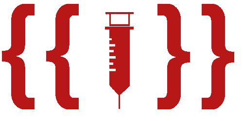
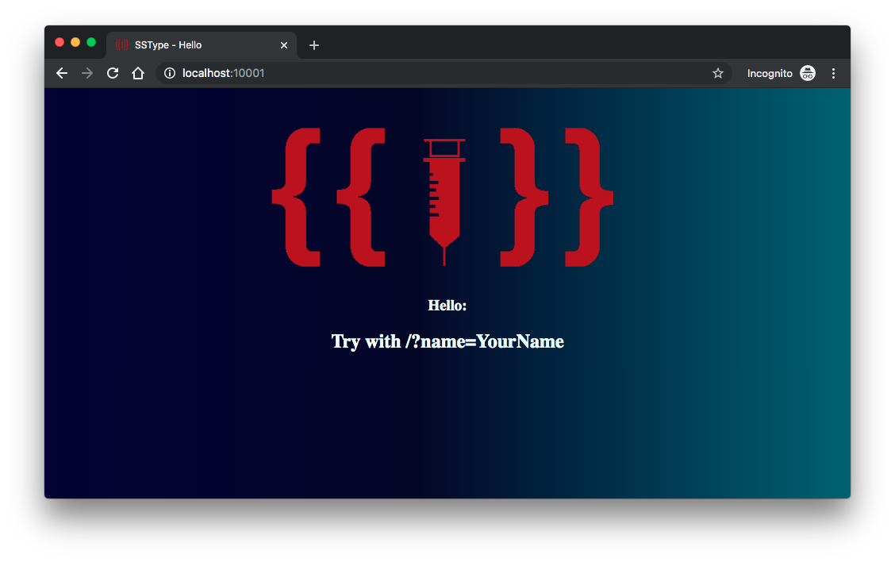

# SSType

<p align="center"></p>

SSType is a simple Python web application that contains an example of a Server-Side Template Injection vulnerability in Tornado. In this example, a specific subcategory of Injection will be exemplified: Server Side Injection or SSTI.

## Index

- [Definition](#what-is-injection)
- [Setup](#setup)

## What is Injection?

Injection flaws, such as SQL, NoSQL, OS, and LDAP injection, occur when untrusted data is sent to an interpreter as part of a command or query. The attacker’s hostile data can trick the interpreter into executing unintended commands or accessing data without proper authorization.

The main goal of this project is to discuss how **Server-Side Template Injection** vulnerabilities can be exploited and to encourage developers to send Pull Requests on how they would mitigate these flaws.

## Setup

To start this intentionally **insecure application**, you will need [Docker][docker install] and [Docker Compose][docker compose install]. You must type the following commands to start:

```sh
cd owasp-top10-apps/task4/sstype
```

```sh
make install
```

Then simply visit [localhost:10001][app], as exemplified below:

<p align="center"></p>

## Get to know the app 💉

To properly understand how this application works, you can do some search using `name` as a query string using a [browser](http://localhost:10001/?name=Vitor) or using `curl` in a terminal:

```sh
curl http://localhost:10001/?name=Vitor
```

<p align="center"></p>
