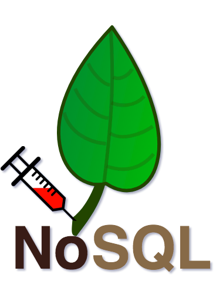
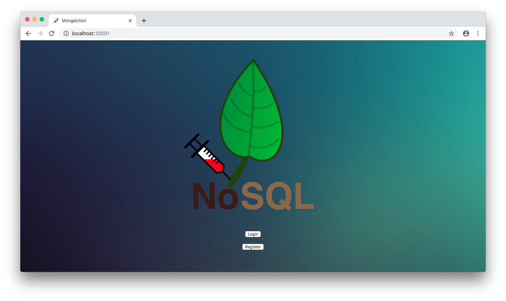

# Mongection

<p align="center"></p>

Mongection is a simple NodeJS web application that simulates a login page. It has both `/register` and `/login` routes that, by communicating with a MongoDB, enable users to register and enter into a generic system.

## Index

- [Definition](#what-is-injection)
- [Setup](#setup)
- [Attack narrative](#attack-narrative)
- [Objectives](#secure-this-app)
- [Solutions](#pr-solutions)
- [Contributing](#contributing)

## What is Injection?

Injection flaws, such as SQL, NoSQL, OS, and LDAP injection, occur when untrusted data is sent to an interpreter as part of a command or query. The attacker’s hostile data can trick the interpreter into executing unintended commands or accessing data without proper authorization.

The main goal of this project is to discuss how **NoSQL Injection** vulnerabilities can be exploited and to encourage developers to send Pull Requests on how they would mitigate these flaws.

## Setup

To start this intentionally **insecure application**, you will need [Docker][docker install] and [Docker Compose][docker compose install]. You must type the following commands to start:

```sh
cd owasp-top10-apps/task5/mongection
```

```sh
make install
```

Then simply visit [localhost:10001][app], as exemplified below:



## Get to know the app 💉

To properly understand how this application works, you can follow these simple steps:

- Register a new user via front-end.
- Login as this user via front-end.

* Register another user now using command line:

```sh
curl -X POST http://localhost:10001/register -H "Content-Type: application/json" --data '{"name":"bob", "email":"bob@example.com", "password":"bobisboss"}'
```

- Login as this second user now using command line:

```sh
curl -X POST http://localhost:10001/login -H "Content-Type: application/json" --data '{"email":"bob@example.com", "password":"bobisboss"}'
```
